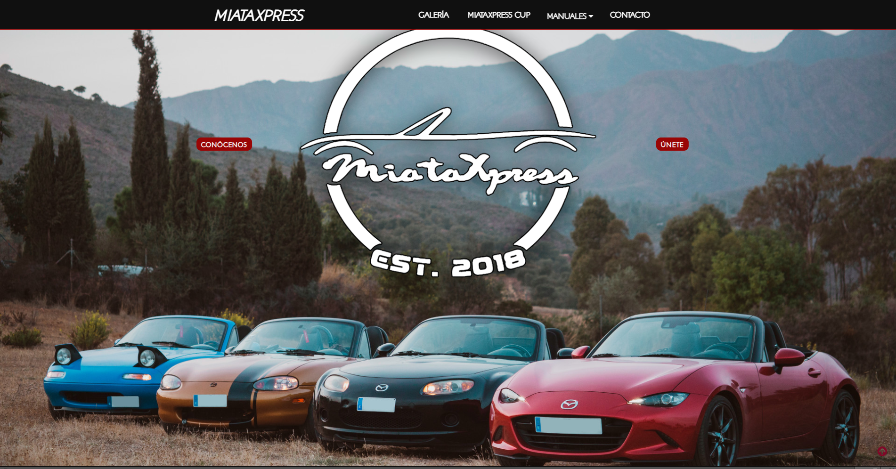
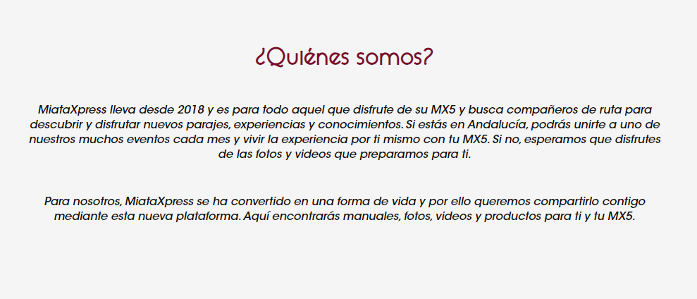
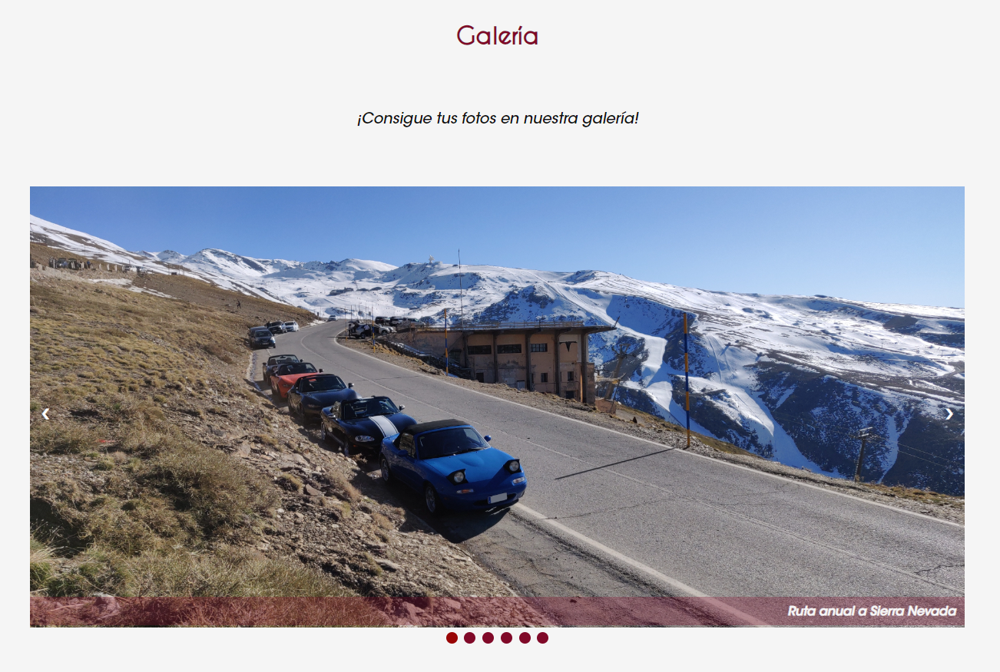
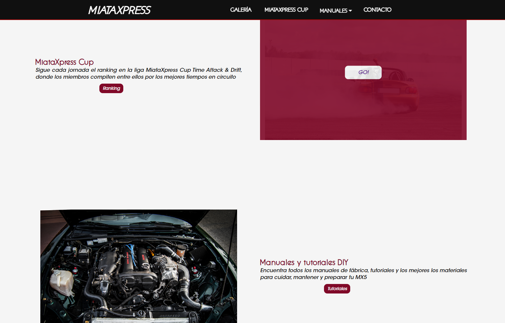
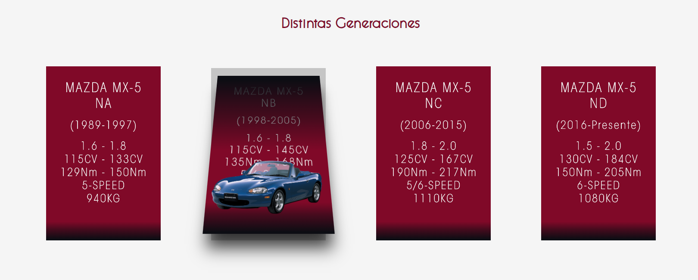
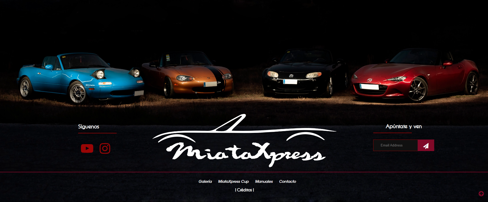

<h1>Memoria del proyecto</h1>
<h2>MiataXpress Web</h2>

Enlaces directo a web navegable:

- <a href="https://antcordero.github.io/MiataXpress/miataxpress.html">Web navegable del proyecto</a>
<h2>Índice</h2>
<ul>
  <li><a href="#introduccion">Introducción</a></li>
  <li><a href="#motivacion">Motivación</a></li>
  <li><a href="#estructura">Estructura</a></li>
  <li><a href="#estilo">Estilo</a></li>
</ul>

<h2 id="introduccion">Introducción</h2>

Trabajo realizado por: Antonio Cordero Molina

Enero de 2024

Licencia CC-BY

<h2 id="motivacion">Motivación</h2>

Creación de una web tipo blog y directorio para el club MiataXpress de Andalucía

<b>Motivo:</b> El club no tiene web propia y pensé en crear una web a modo informativo de proximas salidas, rutas, tutoriales, consejos sobre repuestos, webs de compra, etc. Ya que en el grupo común de Whatsapp siempre se preguntán las mismas dudas, lo que a veces se puede volver pesado.

<h2 id="estructura">Estructura</h2>

La web está dividida en  X secciones:

<ul>
  <li>Hero Section</li>  
  <li>¿Qiénes Somos?</li>
  <li>Galería</li>
  <li>MiataXpress Cup</li>
  <li>Manuales y Tutoriales DIY</li>
  <li>Cards</li>
  <li>Footer</li>
</ul>

<h3>Hero Section</h3>

He utilizado dos imágenes de fondo tomadas de uno de los fotográfos del grupo (@adiazfotos), una imagen se adapta a pantallas grandes (portátil, sobremesa), por otro lado la otra se adapta a pantallas pequeñas (móvil y tablet) 
Sobre ella he colocado dos botones "Call to Action" estilados de forma sencilla

<h3>Introducción</h3>

Texto corto a modo de presentación inicial donde se explica el mótivo del club. Título inicial y texto centrados de forma inicial dejando márgenes al wrapper.

<h3>Galería</h3>

Se muestra Gallería como carrusel de fotos, cada una estilada con título y un hiperenlace en el mismo

<h3>MiataXpress Cup y Manuales y Tutoriales DIY</h3>

Secciones como grid-2 intercambiando foto y texto con título de una seción a otra sección con posición alterna de elementos

<h3>Cards</h3>

Se dispone de 4 cards (1 por cada generación) estladas y con aminación en hover en grid-4 para pantallas de ordenador y tablet y grid-1 en cascada para pantallas de móvil

<h3>Footer</h3>

Footer que cuenta con elementos extilados con grid-2 y un segundo grid-2 al final de la página para los hiperenlaces de la barra de navegación secundaria, copyright y el botón de ventana modal para los recursos. Para pantallas mayores (portátil y pc sobremesa) se muestra una foto de fondo tomada de uno de los fotográfos del grupo (@adiazfotos). En cambio en móvil se muestra un fondo de color sólido y el lógo como grid.

<h2 id="estilo">Estilo de la página</h2>
<h3>Paleta de colores</h3>

 
  <li>body: #f5f5f5 / rgb(245,245,245); Artic White</li>
  <li>#101010 / rgb(16, 16, 16); Jet Black</li>
  <li>buttons: #990505 /  rgb(153, 5, 5) // #800928 / rgb(128, 9, 40); Soul Crystal Red // Dark Red </li>

<h3>Tipografías</h3>

  <li>Títulos: ITC Avant Garde from 1001fonts</li>
  <li>Texto: Queen sides Medium from 1001fonts</li>

<h3>Imágenes</h3>

  Fotografías cedidas por los fotográfos oficiales del grupo
  <li>(<a href="https://www.instagram.com/adiazfotos/">@adiazfotos</a>)</li>
  <li>(<a href="https://www.instagram.com/lule_view/">@luleview</a>)</li>
  <li>(<a href="https://www.instagram.com/rsphoto.eu/">@rsphoto.eu</a>)</li>

<h2 id="snippets">Code snippets</h2>

He utilizado los siguientes:

<ul>
  <li>Barra de navegación: customizada a partir de una idea tomada del canal de Yotube @midudev (<a href="https://www.youtube.com/shorts/ZsGUkdFJRxA">Vídeo de referencia</a>)</li>
  <li>Dropdown Form en la NavBar tomada de W3Scools "CSS Dropdowns" (<a href="https://www.w3schools.com/css/css_dropdowns.asp">url</a>)</li>
  <li>Galería en carrusel tomada de FreeFrontend.com "CSS IMAGE GALLERY - Author: Lubna" (<a href="https://codepen.io/Lubna/pen/MWapdjE">url</a>)</li>
  <li>Overlay effect tomado de W3Scools "How TO - Image Hover Overlay" (<a href="https://www.w3schools.com/howto/howto_css_image_overlay.asp">url</a>)</li>
  <li>Card Animation: estructura para la animación tomada del canal de Yotube @midudev (<a href="https://www.youtube.com/watch?v=D1p2Sl6lxX4&list=LL&index=25">Vídeo de referencia</a>)</li>
  <li>Email Form en el footer: tomada de W3Schools "How TO - HTML input type="email" (<a href="https://www.w3schools.com/tags/att_input_type_email.asp">url</a>)</li>
  <li>Ventana Modal para el los créditos en el footer tomada de W3Schools "How TO - CSS/JS Modal" (<a href="https://www.w3schools.com/howto/howto_css_modals.asp">url</a>)</li>
</ul>
